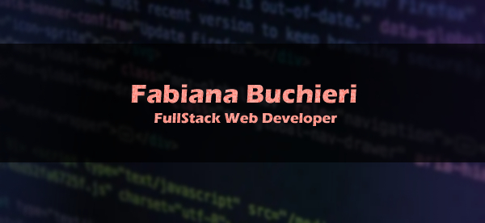

<h1 align="center">Hi 👋, My name is Fabiana</h1>
<h3 align="center">I am a FullStackWeb developer from Argentina, always eager to learn new technologies to give my best in every challenge.</h3>

<h3 align="left">Connect with me:</h3>
- 📫 How to reach me: **<a href="mailto:francabuchieri19@gmail.com">francabuchieri19@gmail.com</a>** 📧 

<h2 align="center">💻Technologies That I Know💻</h2>

<a href="https://angular.io" target="_blank" rel="noreferrer">

<h2 align="center">🖋️✒️Software Design🖍️🖊️</h2>

<h2 align="center">💼Please visit my portfolio💼</h2>

